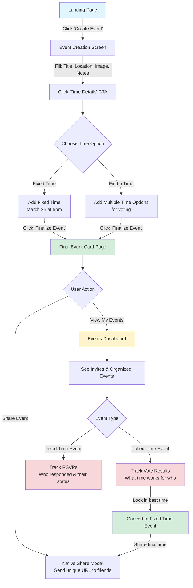

# friends.io User Flow Documentation

## Overview
friends.io helps friends schedule events easily with flexible time options - either fixed times or polling multiple options for group availability.

---

## Complete User Flow Diagram



---

## Key User Paths

### Path 1: Fixed Time Event (Direct)
```
Landing → Create Event → Time Details → Add Fixed Time → Finalize → Event Card → Share
```

### Path 2: Polled Time Event (Voting)
```
Landing → Create Event → Time Details → Find a Time → Add Multiple Options → Finalize → Event Card → Share → Dashboard → Track Votes → Lock Best Time → Share Final Time
```

---

## Screen Specifications

### 1. Landing Page
- **Purpose**: Entry point
- **CTA**: "Create Event" button
- **Auth Required**: No

### 2. Event Creation Screen
- **Fields**:
  - Title (required)
  - Location (required)
  - Image (optional)
  - Notes (optional)
- **CTA**: "Time Details" button
- **Auth Required**: Yes (cookie set here if first event)

### 3. Time Details Screen
- **Options**:
  - **Fixed Time**: Single date/time picker (e.g., "March 25 at 5pm")
  - **Find a Time**: Add multiple time options for voting
- **CTA**: "Finalize Event" button
- **Auth Required**: Yes

### 4. Final Event Card Page
- **Display**: Event summary with all details
- **CTAs**:
  - **Share Event**: Triggers native share modal with unique URL
  - **View My Events**: Navigate to dashboard
- **Auth Required**: Yes

### 5. Events Dashboard
- **Sections**:
  - My Organized Events
  - My Invites
- **Event Type Views**:
  - **Fixed Time Events**: Show RSVP tracking (who responded, their status)
  - **Polled Time Events**: Show vote results (what time works for who)
- **Special Action**: Lock in best time for polled events
- **Auth Required**: Yes

---

## Authentication Flow

### Cookie-Based Auth
- **When Set**: On first event creation
- **What It Contains**: User identifier
- **Where Checked**:
  - Event Creation Screen
  - Time Details Screen
  - Final Event Card Page
  - Events Dashboard
  - Tracking/Management screens

### Public vs. Protected Routes
- **Public**: Landing page, shared event view (via URL)
- **Protected**: All event creation, dashboard, and management screens

---

## Event Types & State Management

### Fixed Time Event
- Single confirmed date/time
- Organizer tracks: RSVPs (Yes/No/Maybe)
- Recipients receive: Invitation with set time
- No conversion needed

### Polled Time Event
- Multiple time options
- Organizer tracks: Vote counts per time slot
- Recipients receive: Voting form
- **Conversion**: Once organizer locks best time → becomes Fixed Time Event
- After conversion: Shares as normal fixed time event

---

## Data Flow

### Event Creation
1. User fills form (title, location, image, notes)
2. User selects time option (fixed OR poll)
3. Event object created with:
   - Basic details
   - Time data (single or multiple options)
   - Organizer ID (from cookie)
   - Unique shareable URL

### Event Sharing
1. Generate unique event URL
2. Trigger native share modal
3. Recipients click URL → view event
4. Recipients respond (RSVP or vote)
5. Responses stored with event

### Dashboard View
1. Query events by user cookie
2. Separate organized vs. invited events
3. Display appropriate tracking interface based on event type

---

## Implementation Notes for AI

When refactoring or building features, ensure:

1. **Consistent cookie handling** across all protected routes
2. **Event ownership** properly tied to organizer cookie
3. **Type discrimination** between fixed and polled events in all views
4. **State conversion** logic when polled events get locked
5. **URL generation** is consistent and secure
6. **Native share modal** integration works across platforms
7. **Vote tallying** logic correctly identifies "best time for most people"

---

## Future Considerations
- Add to this doc as features are built or refactored
- Keep flow diagram updated with any new paths
- Document any edge cases discovered during implementation